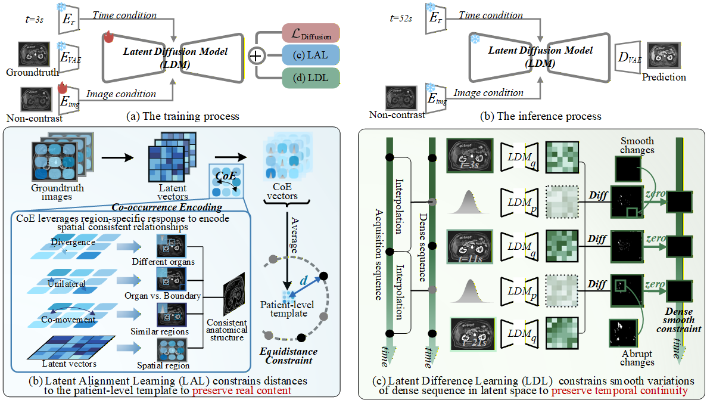

<div align="center">

<h2>MRI Contrast Enhancement Kinetics World Model</h2>

#### [Jindi Kong<sup>1</sup>](https://scholar.google.com/citations?hl=zh-CN&tzom=300&user=Kr-XKIwAAAAJ) · [Yuting He<sup>1</sup>](https://yutinghe-list.github.io/) · Cong Xia<sup>2</sup> · [Rongjun Ge<sup>3</sup>](https://scholar.google.com/citations?user=v8K8HIkAAAAJ&hl=zh-CN) · [Shuo Li<sup>1</sup>](https://scholar.google.com/citations?hl=en&user=6WNtJa0AAAAJ&view_op=list_works&sortby=pubdate) 
<sup>1</sup> Case Western Reserve University, Cleveland, OH, USA  &nbsp;&nbsp; <sup>2</sup> Jiangsu Cancer Hospital, Nanjing, Jiangsu, China  &nbsp;&nbsp; <sup>3</sup> Southeast University, Nanjing, Jiangsu, China

<a href='https://arxiv.org/pdf/2602.19285'></a>


</div>


## ⚙️ The 1st MRI CEKWorld

<div align="center">
  
</div>

**(a) Task** Our MRI Contrast Enhancement Kinetics World Model (MRI CEKWorld) generates contrast-enhanced sequences that conform to kinetics in the human body after contrast agent injection. 
**(b) Problem** Clinical contrast MRI acquisition presents inefficient information yield with adverse risks and higher cost, but a fixed, sparse sequence.
**(c) Adavantages** Our MRI CEKWorld enables continuous contrast-free dynamics with no contrast agent risks, low cost, and convenience


## 🚀 Getting Started
#### 🛠 Installation
Following the ControlNet installation pipeline, the environment configuration can be found [here](https://github.com/lllyasviel/ControlNet/blob/main/environment.yaml):

```bash
conda env create -f environment.yaml
conda activate control
```

#### ⏬ Download weights

The model is trained based on [ControlNet-v1-1](https://huggingface.co/lllyasviel/ControlNet-v1-1/blob/main/control_v11p_sd15_canny.pth) and transferred using [tool_transfer_control](https://github.com/lllyasviel/ControlNet/blob/main/tool_transfer_control.py). Alternatively, you can find the processed initial weights here: [Google Drive](https://drive.google.com/file/d/1V0VVO9YhB_Xh5RG9rmJ8FcRKTnTLS9or/view?usp=drive_link) 🔗.


Our final weights, optimized for abdominal datasets, can be downloaded from the provided links [Google Drive](https://drive.google.com/file/d/1klM0pbL_AT2V0HMm5drbAAoxcQsgPHro/view?usp=drive_link)🔗.

#### 🛠️ Framework
<div align="center">
  
</div>


##### Where to find the implementations

Latent Alignment Learning (LAL) is implemented in `ldm/models/diffusion/ddpm.py`.  
The spatial alignment losses are computed in:
- `compute_log_cholesky_template_and_losses(...)`

This function contains the code for building the latent template (log-Cholesky parameterization) and computing the corresponding spatial consistency/alignment losses.

Latent Difference Learning (LDL) is implemented in `ldm/models/diffusion/ddpm.py`.  
The temporal difference (smoothness) losses are computed in:
- `second_order_temporal_loss_batch(...)`

This function implements the temporal difference regularization used to encourage smooth dynamics over time. The $K_i$ (`num_samples_per_time_interval`) is recommended to try starting from 0 and gradually increasing. If excellent spatial alignment is not achieved, the generated results may collapse.


##### Dataset sampling
The dataset is sampled using the `PatientSliceBatchSampler`, ensuring that each batch contains data from the same slice of the same patient, but at different time points.

## ⭐ Citation
If you find MRI CEKWorld useful for your research, welcome to cite our work using the following BibTeX:
```bibtex
@article{kong2026mri,
  title={MRI Contrast Enhancement Kinetics World Model},
  author={Kong, Jindi and He, Yuting and Xia, Cong and Ge, Rongjun and Li, Shuo},
  journal={arXiv preprint arXiv:2602.19285},
  year={2026}
}
```

## ❤️ Acknowledgement
This code is mainly built upon [ControlNet](https://github.com/lllyasviel/ControlNet/tree/main),  thanks to their invaluable contributions.
